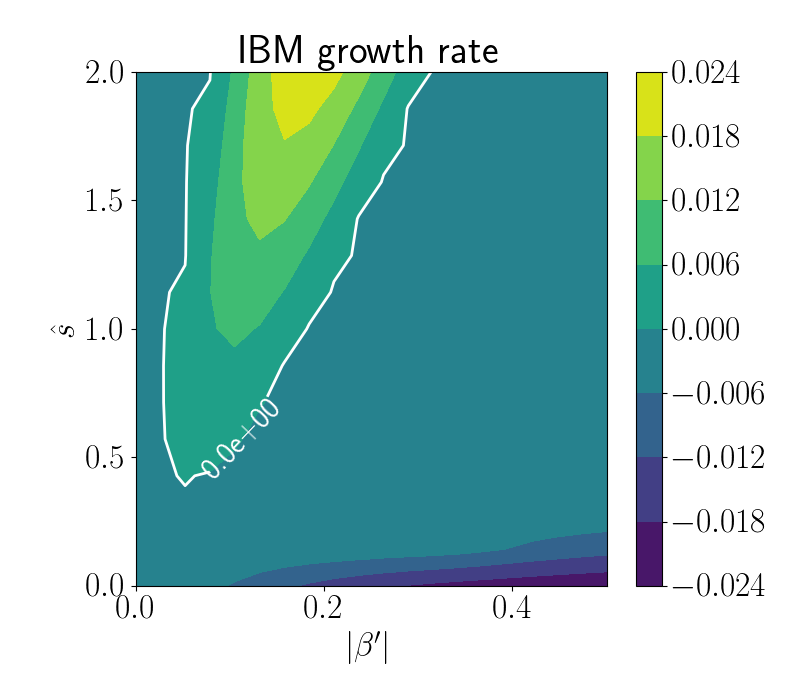

=======================
Ideal ballooning solver
=======================

This example runs the ideal ballooning solver in pyrokinetics for a
range of :math:`\hat{s}` and :math:`\beta` and plots this data

.. literalinclude:: example_ideal_ballooning.py

This would generate the following figure

Note this works for any `pyro` object independant of the `LocalGeometry`
chosen. 

The algorithm used to solve the ideal ballooning equation was taken from 
`ideal-ballooning-solver`_

.. _ideal_ballooning_solver: https://github.com/rahulgaur104/ideal-ballooning-solver
