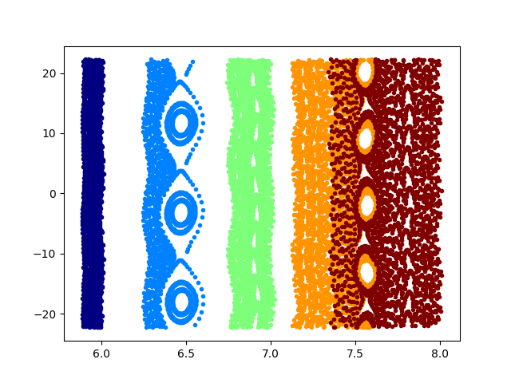

====================================================
Field line following and Poincaré maps
====================================================

This page describes the ``FieldLine`` diagnostic available in
``pyrokinetics``. This diagnostic allows the user to follow perturbed
magnetic field lines in gyrokinetic simulations and compute quantities
such as:

- Poincaré maps
- radial diffusion coefficients
- radial displacement
- magnetic field correlation lengths
- field line tearing parameter (linear)

These diagnostics are particularly useful for analysing magnetic
stochasticity and transport in nonlinear gyrokinetic simulations.

The diagnostic operates by integrating the perturbed magnetic field
along a magnetic field line using the fluctuating parallel vector
potential :math:`A_{||}` obtained from the simulation output.

This functionality is available through the class
``pyrokinetics.diagnostics.field_line.FieldLine``.

----------------------------------------------------
Basic usage
----------------------------------------------------

First we import ``pyrokinetics`` and create a ``Pyro`` object for the
simulation we want to analyse.

.. code-block:: python

    import numpy as np
    import matplotlib.pyplot as plt

    from pyrokinetics import Pyro, template_dir
    from pyrokinetics.diagnostics.field_line import FieldLine

    fname = template_dir / "outputs/CGYRO_nonlinear/input.cgyro"
    pyro = Pyro(gk_file=fname, gk_code="CGYRO")

    pyro.load_gk_output()

Next we define the initial positions of the magnetic field lines we
want to follow. These are given in the flux-tube coordinates
:math:`(x,y)`.

.. code-block:: python

    xarray = np.linspace(6, 8, 5) * pyro.norms.rhoref
    yarray = np.linspace(-10, 10, 3) * pyro.norms.rhoref

We also specify:

- the number of poloidal turns
- the time slice of the simulation
- the value of :math:`\rho_*`

.. code-block:: python

    nturns = 1000
    time = 1
    rhostar = 0.036

Now create the diagnostic object and compute the field line trajectories.

.. code-block:: python

    diag = FieldLine(pyro)
    coords = diag.follow_field_line(xarray, yarray, nturns, time, rhostar)

The result is an array containing the coordinates of each field line
intersection:

.. code-block:: text

    shape = (2, nturns, len(yarray), len(xarray))

where

- ``coords[0]`` is the radial coordinate :math:`x`
- ``coords[1]`` is the binormal coordinate :math:`y`

----------------------------------------------------
Plotting a Poincaré map
----------------------------------------------------

A Poincaré map can be generated by plotting the successive
intersection points of the field line with a poloidal plane.

.. code-block:: python

    colorlist = plt.cm.jet(np.linspace(0, 1, xarray.shape[0]))

    plt.figure()

    for i, color in enumerate(colorlist):
        plt.plot(
            coords[0, :, :, i].ravel().m,
            coords[1, :, :, i].ravel().m,
            ".",
            color=color,
        )

    plt.xlabel("x")
    plt.ylabel("y")
    plt.show()

These maps can be used to visualise magnetic island structures and
stochastic magnetic field regions.

----------------------------------------------------
Field line integration
----------------------------------------------------

The field line trajectories are computed by integrating the perturbed
magnetic field components along the equilibrium field line.

The displacement of the radial coordinate :math:`x` along the field
line is given by

.. math::

    \Delta x =
    \Delta \theta
    \frac{\delta \mathbf{B}\cdot\nabla x}
    {\mathbf{B}\cdot\nabla\theta}

The perturbed magnetic field can be written as

.. math::

    \delta \mathbf{B}
    =
    \delta B^x a_x +
    \delta B^y a_y +
    \delta B^\theta a_\theta

Since

.. math::

    \delta \mathbf{B}\cdot\nabla x = \delta B^x

we only need the radial component of the perturbed magnetic field.

----------------------------------------------------
Magnetic field from the vector potential
----------------------------------------------------

The perturbed magnetic field is obtained from the curl of the vector
potential:

.. math::

    \delta B^x =
    \frac{1}{J_{xy\theta}}
    \left(
    \frac{\partial \delta A_\theta}{\partial y}
    -
    \frac{\partial \delta A_y}{\partial \theta}
    \right)

.. math::

    \delta B^y =
    \frac{1}{J_{xy\theta}}
    \left(
    \frac{\partial \delta A_x}{\partial \theta}
    -
    \frac{\partial \delta A_\theta}{\partial x}
    \right)

Assuming the :math:`\theta` derivatives are negligible

.. math::

    \frac{\partial}{\partial\theta} \rightarrow 0

this becomes

.. math::

    \delta B^x =
    \frac{1}{J_{xy\theta}}
    \frac{\partial \delta A_\theta}{\partial y}

.. math::

    \delta B^y =
    -\frac{1}{J_{xy\theta}}
    \frac{\partial \delta A_\theta}{\partial x}

----------------------------------------------------
Parallel vector potential
----------------------------------------------------

The gyrokinetic simulations provide the parallel vector potential

.. math::

    A_{||} = \delta \mathbf{A} \cdot \hat{b}

where

.. math::

    \hat{b} =
    \frac{a_\theta}{\sqrt{g_{\theta\theta}}}

so that

.. math::

    A_{||} =
    \frac{\delta A_\theta}{\sqrt{g_{\theta\theta}}}

Substituting this into the expressions for the magnetic field gives

.. math::

    \delta B^x =
    \frac{\sqrt{g_{\theta\theta}}}{J_{xy\theta}}
    \frac{\partial A_{||}}{\partial y}

.. math::

    \delta B^y =
    -\frac{\sqrt{g_{\theta\theta}}}{J_{xy\theta}}
    \frac{\partial A_{||}}{\partial x}

Using Fourier modes

.. math::

    \partial_y \rightarrow -i k_y

we obtain

.. math::

    \delta B^x =
    -i
    \frac{\sqrt{g_{\theta\theta}}}{J_{xy\theta}}
    k_y A_{||}

----------------------------------------------------
Final field line equation
----------------------------------------------------

Using the identity

.. math::

    \mathbf{B}\cdot\nabla\theta
    =
    \frac{d\psi}{dr}\frac{1}{J_{r\alpha\theta}}

and

.. math::

    C_y =
    \frac{1}{B_{ref}}
    \frac{\partial\psi}{\partial r}

the radial displacement becomes

.. math::

    dx =
    -\frac{i k_y}{B_{ref}}
    \int d\theta
    \sqrt{g_{\theta\theta}} A_{||}

This is the quantity integrated numerically in the code to determine
the field line trajectory.

----------------------------------------------------
Additional diagnostics
----------------------------------------------------

The ``FieldLine`` class also provides several additional diagnostics.

====================================================
Field line tearing parameter
====================================================

For **linear gyrokinetic simulations**, the radial displacement of a
magnetic field line over one poloidal turn can be used to identify
microtearing modes (MTMs). These modes produce a finite radial shift of
magnetic field lines associated with reconnection driven by the
parallel vector potential :math:`A_{||}`.

The ``compute_linear_tearing_parameter`` diagnostic estimates the
*net field-line deviation* over a poloidal circuit using the
parallel vector potential structure along the field line.

The returned quantity is a **dimensionless tearing parameter**
defined as the ratio of the net displacement to the total excursion
along the field line.

----------------------------------------------------
Field line distance element
----------------------------------------------------

In field-aligned coordinates the differential length along the
magnetic field line is determined by the field-aligned covariant
metric element

.. math::

    g_{\theta\theta}

The infinitesimal distance travelled along the field line is therefore

.. math::

    dl = \sqrt{g_{\theta\theta}} \, d\theta

where :math:`\theta` is the poloidal angle.

----------------------------------------------------
Weighted field-line displacement
----------------------------------------------------

The parallel vector potential :math:`A_{||}` determines the magnetic
perturbation responsible for magnetic reconnection. To estimate the
net field line deviation over one poloidal turn we consider the
quantity

.. math::

    A_{||} \sqrt{g_{\theta\theta}}

which weights the magnetic perturbation by the physical length
element along the field line.

Integrating this along the field line gives the total signed
displacement

.. math::

    \Delta =
    \int A_{||}(\theta)\sqrt{g_{\theta\theta}} \, d\theta

However, since :math:`A_{||}` can change sign along the field line,
a useful measure of the *net tearing displacement* is obtained by
normalising the signed integral by the total magnitude of the
excursion:

.. math::

    T =
    \frac{\left|
        \int A_{||}(\theta)\sqrt{g_{\theta\theta}} \, d\theta
    \right|}
    {\int
        \left|A_{||}(\theta)\sqrt{g_{\theta\theta}}\right|
        d\theta}

This dimensionless quantity

.. math::

    0 \le T \le 1

measures how coherent the magnetic perturbation is along the field
line.

----------------------------------------------------
Physical interpretation
----------------------------------------------------

- :math:`T \approx 0`

  The perturbation changes sign frequently along the field line and
  the net displacement cancels. This is typical of **electrostatic
  or non-tearing modes**.

- :math:`T \approx 1`

  The perturbation maintains a coherent sign along the field line,
  producing a finite radial displacement per poloidal turn.
  This behaviour is characteristic of **microtearing modes (MTMs)**.

Thus the tearing parameter provides a convenient way to identify
microtearing activity in **linear gyrokinetic simulations**.

----------------------------------------------------
Implementation
----------------------------------------------------

The algorithm performs the following steps:

1. Extract the parallel vector potential

   .. code-block:: python

       apar = gk_output["apar"].isel(kx=0, ky=0, time=-1)

2. Restrict the domain to the symmetric ballooning region.

3. Compute the field-aligned metric component

   .. math::

       g_{\theta\theta}

4. Reconstruct the metric over the ballooning domain.

5. Form the weighted perturbation

   .. math::

       A_{||}\sqrt{g_{\theta\theta}}

6. Integrate along :math:`\theta` using Simpson integration.

The tearing parameter is then computed numerically as

.. code-block:: python

    apar_dl = apar * np.sqrt(g_theta_theta)

    tearing_parameter = abs(
        simpson(apar_dl, x=theta)
    ) / simpson(
        abs(apar_dl), x=theta
    )

This diagnostic is particularly useful for automatically detecting
microtearing behaviour in linear parameter scans.

Radial diffusion coefficient
----------------------------

The radial diffusion coefficient can be computed using

.. code-block:: python

    D_r = diag.radial_diffusion_coefficient(
        xarray,
        yarray,
        nturns,
        time,
        rhostar,
    )

This is obtained from the mean square radial displacement of the field
lines.

Radial displacement
-------------------

The average radial displacement along the field line can be computed
using

.. code-block:: python

    delta_r = diag.compute_half_displacement(
        xarray,
        yarray,
        time,
        rhostar,
    )

Magnetic field correlation length
---------------------------------

The parallel correlation length of the magnetic field fluctuations can
be computed with

.. code-block:: python

    lambda_Bxx = diag.parallel_correlation_length(time)

This quantity is computed using the Wiener–Khinchin theorem and the
power spectrum of the magnetic field fluctuations.

----------------------------------------------------
Summary
----------------------------------------------------

The ``FieldLine`` diagnostic provides a flexible way to study magnetic
field structure in gyrokinetic turbulence simulations. It enables
analysis of:

- stochastic magnetic field topology
- magnetic island formation
- radial magnetic transport
- correlation properties of magnetic fluctuations
- field line tearing parameter (linear)

These tools are particularly useful for understanding magnetic
stochasticity and its contribution to transport in magnetised plasmas.