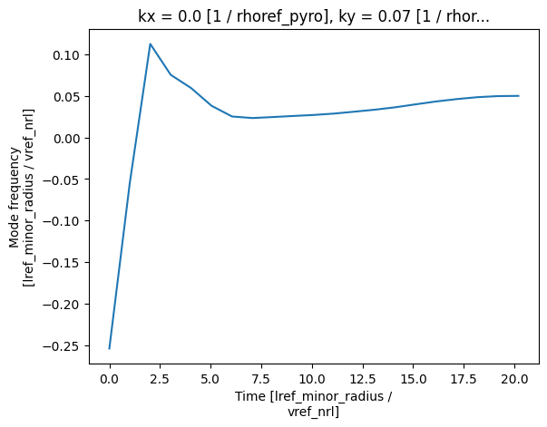
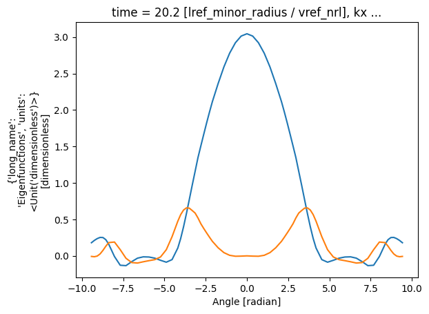
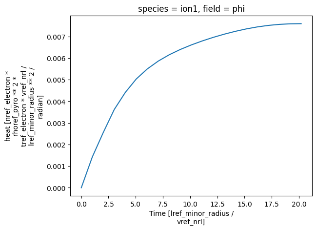
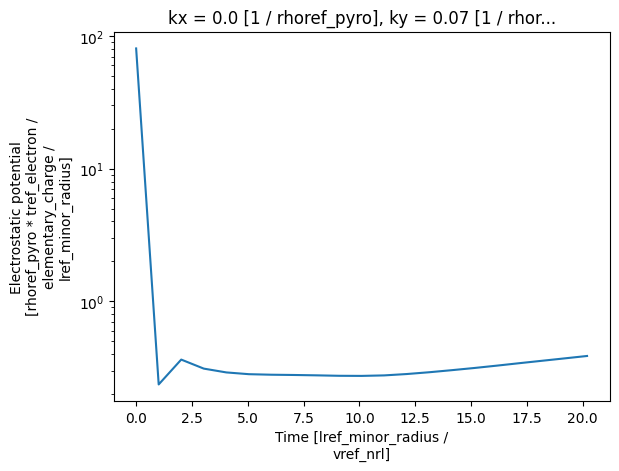

============================================
 Reading and plotting linear outputs
============================================

The following discusses how one is able to obtain and visualise data from linear gyrokinetic
simulations within ``pyrokinetics``.

We first need to load in our data from the desired directory using a `Pyro` object.
Using GS2 as our example code,

.. code:: python

    from pyrokinetics import Pyro, template_dir

    # Point to GS2 input file
	gs2_template = template_dir / "outputs/GS2_linear/gs2.in"

	# Load in file
	pyro = Pyro(gk_file=gs2_template, gk_code="GS2")

	# Load in GS2 output data
	pyro.load_gk_output()
    data = pyro.gk_output

Here we have loaded up the ``data`` object. More information about this can be obtained by printing

.. code-block:: python

    >>> print(data)
    <pyrokinetics.GKOutput>
    (Wraps <xarray.Dataset>)
    Dimensions:         (theta: 73, kx: 1, ky: 1, time: 21, field: 1, species: 2,
    					energy: 8, pitch: 37, flux: 3)
    Coordinates:
      * time            (time) float64 0.0 1.01 2.02 3.03 ... 17.17 18.18 19.19 20.2
      * kx              (kx) float64 0.0
      * ky              (ky) float64 0.07
      * theta           (theta) float64 -9.425 -9.25 -9.076 ... 9.076 9.25 9.425
      * energy          (energy) float64 0.004047 0.1044 0.5516 ... 4.739 5.936 7.25
      * pitch           (pitch) float64 0.003676 0.01921 0.04652 ... 1.182 1.194
      * species         (species) <U8 'ion1' 'electron'
      * field           (field) <U3 'phi'
      * flux            (flux) <U8 'particle' 'heat' 'momentum'
    Data variables:
        phi             (theta, kx, ky, time) complex128 [([tref] / [mref])**(0.5) * [mref] / [bref_B0])·tref_electron/e/lref_minor_radius] ...
        particle        (field, species, ky, time) float64 [([tref] / [mref])**(0.5)·([tref] / [mref])**(0.5) * [mref] / [bref_B0])²·nref_electron/lref_minor_radius²/rad] ...
        heat            (field, species, ky, time) float64 [([tref] / [mref])**(0.5)·([tref] / [mref])**(0.5) * [mref] / [bref_B0])²·nref_electron·tref_electron/lref_minor_radius²/rad] ...
        momentum        (field, species, ky, time) float64 [([tref] / [mref])**(0.5) * [mref] / [bref_B0])²·nref_electron·tref_electron/lref_minor_radius/rad] ...
        growth_rate     (kx, ky, time) float64 [lref_minor_radius/([tref] / [mref])**(0.5)] ...
        mode_frequency  (kx, ky, time) float64 [lref_minor_radius/([tref] / [mref])**(0.5)] ...
        eigenvalues     (kx, ky, time) complex128 [lref_minor_radius/([tref] / [mref])**(0.5)] ...
        eigenfunctions  (field, theta, kx, ky, time) complex128 [] (4.22038619873...
    Attributes: (12/14)
        linear:                 True
        gk_code:                GS2
        input_file:             &kt_grids_knobs\n    grid_option = 'single'\n/\n\...
        attribute_units:        {}
        title:                  GKOutput
        software_name:          Pyrokinetics
        ...                     ...
        object_uuid:            7bb419cd-8e4d-4465-b075-8baf37c18d34
        object_created:         2023-08-07 16:47:06.639348
        session_uuid:           cba1d994-3318-4e40-8c4d-c41e042a2b3e
        session_started:        2023-08-07 16:46:59.397799
        netcdf4_version:        1.6.1
        growth_rate_tolerance:  <xarray.DataArray 'time' ()>\n<Quantity(0.0564343...

where we can see the different data variables available, including their dimensionality, coordinates and units.

To read our desired variable, we use the syntax ``data["Data_variable"]``

.. code:: python

    # Get eigenvalues
    eigenvalues = data["eigenvalues"]
    growth_rate = data["growth_rate"]
    mode_freq = data["mode_frequency"]

For linear simulations, one tends to only have a single ``ky`` and ``kx``, and thus
data variables such as ``growth_rate`` and ``mode_frequency`` are essentially 1D
functions of time. These can be plotted using ``plot`` (see xarray's `Plotting`_ for further details):

.. code:: python

    mode_freq.plot(x="time")
    plt.show()

For data variables with higher dimensions, indexing can be performed with ``.isel``, in the case that indices are
specified by integers, and ``.sel``, when indices are specified by strings. For example, to plot the ``phi``
eigenfunction at the final time point as a function of ``theta``,

.. code:: python

    # Plot eigenfunction
    phi_eig = np.real(data["eigenfunctions"].sel(field="phi").isel(time=-1))
    phi_eig.plot(x="theta", label = "Real")

    phi_i_eig = np.imag(data["eigenfunctions"].sel(field="phi").isel(time=-1))
    phi_i_eig.plot(x="theta", label = "Imag")

    plt.legend()
    plt.show()

Similarly for the linear fluxes, one can again specify the coordinates for the desired data.
For example, to plot the electrostatic ion energy fluxes,

.. code:: python

    # Plot ion energy flux
    ion_flux = data["heat"].sel(field="phi", species="ion1").sum(dim="ky")
    ion_flux.plot()
    plt.show()

And analogously for the field data, for example looking at
the magnitude of the ``phi`` fluctuations at :math:`\theta = 0.0`,

.. code:: python

    # Plot phi
    phi = data["phi"].sel(theta=0.0, method="nearest").isel(ky=0).isel(kx=0)
    phi = np.abs(phi)
    phi.plot.line(x="time")
    
    plt.yscale("log")
    plt.show()

Details regarding normalisations and units can be found in `sec-normalisation-docs`.

.. _Plotting: https://docs.xarray.dev/en/stable/user-guide/plotting.html
