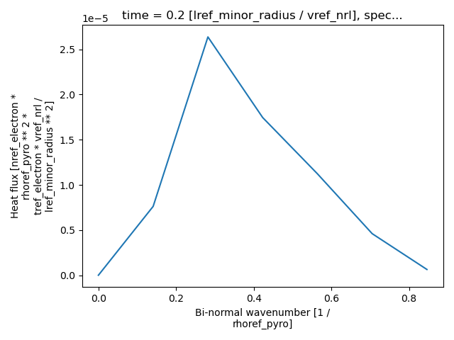
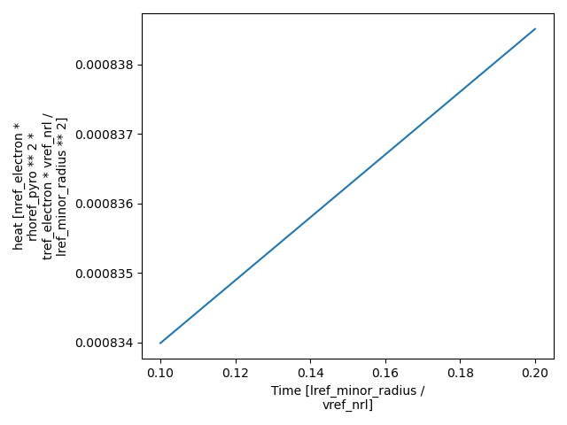
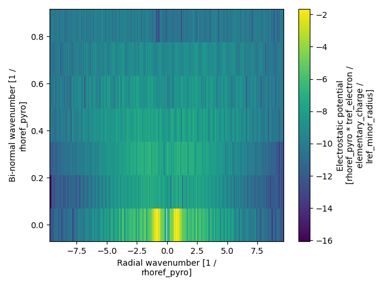

====================================================
Reading and plotting nonlinear outputs
====================================================

This is a step-by-step guide on how to use ``pyrokinetics`` to read the output of a nonlinear gyrokinetic simulation
and create some simple plots. In this guide, we will use the example nonlinear output from CGYRO. The same ideas
apply for any gyrokinetic codes supported in ``pyrokinetics``,

Let's first import ``pyrokinetics`` and define our nonlinear input file.  

.. code-block:: python

    >>> from pyrokinetics import Pyro, template_dir
    >>> import matplotlib.pyplot as plt
    >>> import numpy as np
    >>> gk_file = template_dir / "outputs/CGYRO_nonlinear/input.cgyro"
    >>> pyro = Pyro(gk_file=gk_file)

The gyrokinetic file ``input.cgyro`` is our input file template where we set all the extra flags that have been used
in the simulation.

We can then read the nonlinear simulation into a dataset using ``pyrokinetics`` which is stored as a ``GkOutput``
object

.. code-block:: python 

    >>> pyro.load_gk_output(load_fields=True, load_fluxes=True, load_moments=True)
    >>> data = pyro.gk_output.data

In this we have decided to load in the fluxes and full 3D fields and the moments of the distribution function
using the kwargs `load_fluxes`, `load_fields` and `load_moments` respectively, all of which are optional. Here we
initialise the utility base dataclass ``GKOutputArgs`` which is used to pass quantities to
``GKOutput``. Derived classes include ``Coords``, ``Fields``, ``Fluxes``, ``Moments`` etc. This class contains
features such as automatic unit conversion and a dict-like interface to quantities. Derived classes should define an
``InitVar[Tuple[str, ...]]`` called ``dims``, which sets the dimensionality of each quantity, e.g.
``("kx", "ky", "time")``.

It is helpful to view the  different data stored in the ``pyro`` object along with the dimensions of each quantity. 

.. code-block:: python 

    >>> print(pyro.gk_output)
    <xarray.Dataset>
    Dimensions:      (theta: 16, kx: 256, ky: 7, time: 2, species: 2, field: 3,
                      energy: 8, pitch: 32, flux: 3, moment: 3)
    Coordinates:
      * time         (time) float64 0.1 0.2
      * kx           (kx) float64 -9.731 -9.655 -9.579 -9.503 ... 9.503 9.579 9.655
      * ky           (ky) float64 0.0 0.141 0.282 0.423 0.564 0.705 0.846
      * theta        (theta) float64 -3.142 -2.794 -2.435 ... 2.058 2.435 2.794
      * energy       (energy) float64 0.002008 0.05163 0.2767 ... 3.334 5.312 7.308
      * pitch        (pitch) float64 -0.9973 -0.9856 -0.9648 ... 0.9856 0.9973
      * species      (species) <U8 'electron' 'ion1'
      * field        (field) <U4 'phi' 'apar' 'bpar'
      * flux         (flux) <U8 'particle' 'heat' 'momentum'
      * moment       (moment) <U11 'density' 'temperature' 'velocity'
    Data variables:
        phi          (theta, kx, ky, time) complex64 [([tref] / [mref])**(0.5) * [mref] / [bref_B0])·tref_electron/e/lref_minor_radius] ...
        apar         (theta, kx, ky, time) complex64 [([tref] / [mref])**(0.5) * [mref] / [bref_B0])²·bref_B0/lref_minor_radius] ...
        bpar         (theta, kx, ky, time) complex64 [([tref] / [mref])**(0.5) * [mref] / [bref_B0])·bref_B0/lref_minor_radius] ...
        density      (theta, kx, species, ky, time) complex64 [([tref] / [mref])**(0.5) * [mref] / [bref_B0])·nref_electron/lref_minor_radius] ...
        temperature  (theta, kx, species, ky, time) complex128 [([tref] / [mref])**(0.5) * [mref] / [bref_B0])·tref_electron/lref_minor_radius] ...
        velocity     (theta, kx, species, ky, time) complex64 [([tref] / [mref])**(0.5)·([tref] / [mref])**(0.5) * [mref] / [bref_B0])/lref_minor_radius] ...
        particle     (field, species, ky, time) float32 [([tref] / [mref])**(0.5)·([tref] / [mref])**(0.5) * [mref] / [bref_B0])²·nref_electron/lref_minor_radius²] ...
        heat         (field, species, ky, time) float32 [([tref] / [mref])**(0.5)·([tref] / [mref])**(0.5) * [mref] / [bref_B0])²·nref_electron·tref_electron/lref_minor_radius²] ...
        momentum     (field, species, ky, time) float32 [([tref] / [mref])**(0.5) * [mref] / [bref_B0])²·nref_electron·tref_electron/lref_minor_radius] ...
    Attributes: (12/13)
        linear:            False
        gk_code:           CGYRO
        input_file:        N_ENERGY = 8\nE_MAX = 8\nN_XI = 32\nN_THETA = 16\nN_RA...
        attribute_units:   {}
        title:             GKOutput
        software_name:     Pyrokinetics
        ...                ...
        object_type:       GKOutput
        object_uuid:       8d9f0d00-65d9-4857-9c17-45b0e23e4240
        object_created:    2024-03-26 12:01:42.976982
        session_uuid:      24613d9b-80a3-4eae-a8ce-b00417e58d61
        session_started:   2024-03-26 11:59:01.793200
        netcdf4_version:   1.6.4

The outputs are stored as a `xarray Dataset`_ which allows for fast manipulation of data using the built-in methods
of xarray. Note that all the data variables have units. Whilst reading in outputs, all data is converted to the
pyrokinetics normalisation convention. Details regarding normalisations and units can be found in
`sec-normalisation-docs`.

Let's suppose we want to plot the ky spectrum of the electron heat fluxes from our nonlinear simulation.
First, we need to extract the relevant quantities from the dataset. After examining the data set, we see that the
heat and particle fluxes are given as functions of ``("field", "species", "ky", "time")``. In order to plot the fluxes
as a function of ky we must select out the relevant species, field and time.

.. code-block:: python

    >>> electron_heat_flux_ky = data["heat"].sel(field="phi", species="electron").isel(time=-1)
    >>> electron_heat_flux_ky.plot()
    >>> plot.show()

We could of course choose to average over the time dimension instead. Similarly if we want to plot the total heat flux
as a function of time we would need to sum over the fields, species and `ky` to obtain this.

.. code-block:: python

    >>> total_heat_flux_time = data["heat"].sum(dim=["field", "species", "ky"])
    >>> total_heat_flux_time.plot()
    >>> plot.show()

We can also plot the field data. Below we plot the electrostatic potential as a function of `kx` and `ky` for at
the final time slice when `theta=0.0`. Note here we want to plot log(phi) but as phi currently has units we need to
remove them using the `.pint.dequantify()` method

.. code-block:: python 

    >>> phi = data["phi"].sel(theta=0.0, method="nearest", drop=True).isel(time=-1, drop=True)
    >>> log_phi = np.log(np.abs(phi).pint.dequantify())
    >>> log_phi.plot(x="kx", y="ky")
    >>> plt.show()

.. _xarray Dataset: https://docs.xarray.dev/en/stable/generated/xarray.Dataset.html
