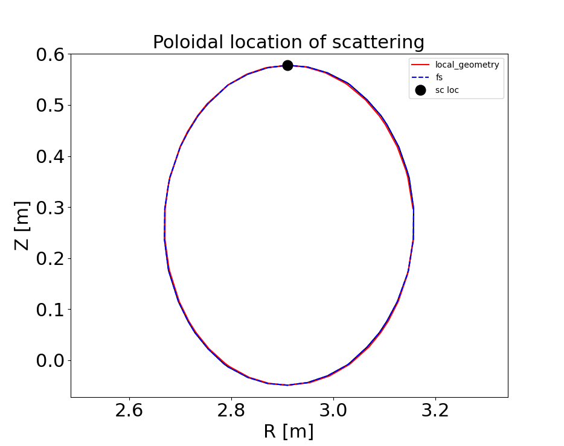

.. _sec-syn-hk-dbs:

============================================
        Using synthetic diagnostic
============================================

.. _RuizRuiz-PPCF-2019: https://iopscience.iop.org/article/10.1088/1361-6587/ab4742/meta 
.. _RuizRuiz-PPCF-2020: https://iopscience.iop.org/article/10.1088/1361-6587/ab82de/meta 
.. _RuizRuiz-PoP-2020:  https://pubs.aip.org/aip/pop/article/27/12/122505/1061970
.. _RuizRuiz-PPCF-2022: https://iopscience.iop.org/article/10.1088/1361-6587/ac5916/meta
.. _Hall-Chen-PPCF-2022: https://iopscience.iop.org/article/10.1088/1361-6587/ac57a1/meta 

What is a synthetic diagnostic?

A synthetic diagnostic uses synthetic, or numerically-generated, plasma information to mimic a real, experimental measurement. In practice, synthetic diagnostics can be used to perform quantitative comparisons between experimental measurements and numerical simulations, as well as to project and predict inexistent experiments, measurements, or diagnostics.
Here we describe the implementation of a synthetic diagnostic developed for the measurement of high-k scattering density fluctuations, that is based on the work of RuizRuiz-PPCF-2019_, RuizRuiz-PPCF-2020_, and RuizRuiz-PoP-2020_. 
Under some conditions, the high-k synthetic diagnostic can be used to understand the measurement of Doppler backscattering, as described in RuizRuiz-PPCF-2022_. 
Further development is underway to implement more advanced synthetic diagnostics, such as a synthetic diagnostic for Doppler backscattering based on Gaussian beam tracing Hall-Chen-PPCF-2022_, high-k scattering, as well as cross-polarization scattering. 

The following discusses how one uses the synthetic diagnostic for ``pyrokinetics``. The steps in the synthetic diagnostic are the following:

1. Inputs are diagnostic specific (diagnostic, filter, k, location, resolution, local :math:`\rho_s`). See ``example_syn_hk_dbs.py``

2. Load equilibrium, kinetics files (profiles). Find scattering location theta. See ``__init__`` in class ``SyntheticHighkDBS``

3. Map :math:`(k_n, k_b)` to :math:`(k_x, k_y)` for all k's / channels specified in 1. See function ``mapk``

4. Load GK output data (fluctuation moment file, typically electron density fluctuations). See function ``get_syn_fspec``

5. For each input condition (eg. for each k in highk/DBS), filter simulation data. See class ``Filter``, functions ``apply_filter``, ``get_syn_fspec``

6. Generate synthetic spectra and make plots. See functions ``get_syn_fspec``, ``plot_syn`` .

1.
--

The first step is to provide input data from the specific diagnostic (high-k, DBS for now). See ``example_syn_hk_dbs.py`` as reference. 

Here we have defined the necessary inputs for the synthetic diagnostic. 

.. code:: python

    from pyrokinetics.diagnostics import SyntheticHighkDBS
    import numpy as np
    import matplotlib.pyplot as plt
    from pyrokinetics.units import ureg
        
    # inputs
    diag = "highk"                      # 'highk', 'dbs', 'rcdr', 'bes', 'cps'
    filter_type = ("gauss")             # 'bt_slab', 'bt_scotty', 'gauss' 
    Rloc = 2.89678 * ureg.meter         # R location of scattering [m]
    Zloc = 0.578291 * ureg.meter        # Z location of scattering [m]       
    Kn0_exp = np.asarray([0.5, 1]) / ureg.centimeter      # Normal components of scattered k [cm-1]
    Kb0_exp = np.asarray([0.1, 0.2]) / ureg.centimeter    # Binormal components of scattered k [cm-1]
    wR = 0.1 * ureg.meter       # Spatial resolution in R direction, also R extent of scattering volume [m]
    wZ = 0.05 * ureg.meter      # Spatial resolution in Z direction, or Z extent of scattering volume [m]
    eq_file = "path_to_equilibrium_file"
    kinetics_file = eq_file
    simdir = "path_to_simulation_directory"
    savedir = "path_to_save_figures"
    if_save = 0
    fsize = 22      # fontsize of plots

2. 
--

Next, call ``SyntheticHighkDBS``, which defines the ``syn_diag`` object. 

.. code:: python

    syn_diag = SyntheticHighkDBS(
        diag=diag,
        filter_type=filter_type,
        Rloc=Rloc,
        Zloc=Zloc,
        Kn0_exp=Kn0_exp,
        Kb0_exp=Kb0_exp,
        wR=wR,
        wZ=wZ,
        eq_file=eq_file,
        kinetics_file=kinetics_file,
        simdir=simdir,
        savedir=simdir,
        fsize=fsize,
    )

In the ``__init__`` of ``SyntheticHighkDBS``, we also calculate the scattering location in theta from a given :math:`(R_{loc},Z_{loc})` location. 
For that, we first find the radial location (poloidal flux :math:`\psi` ) corresponding to :math:`(R_{loc},Z_{loc})`. 
Then, we fit the flux surface using the local geometry specification (eg. "Miller", "MXH"), similar to what should be used in the GK simulation output. 

.. code:: python

    # calculate thetaloc
    pyro = Pyro(
        eq_file=eq_file,
        kinetics_file=kinetics_file,
        gk_file=simdir + "/input.cgyro",
    )
    self.pyro = pyro
    self.eq = pk.read_equilibrium(eq_file)
    self.psin = self.eq._psi_RZ_spline(
        Rloc * pyro.norms.units.meter, Zloc * pyro.norms.units.meter
    ) / (self.eq.psi_lcfs - self.eq.psi_axis)
    pyro.load_local(psi_n=self.psin, local_geometry="Miller")
    self.geometry = pyro.local_geometry
    pyro.load_metric_terms()

Once we have a radial location (poloidal flux :math:`\psi`) and flux-surface parametrization, we find the theta grid point that corresponds to an :math:`(R,Z)` that is closest to :math:`(R_{loc}, Z_{loc})`. 
For theta locations above the magnetic axis Z location, we can calculate it as:

.. code:: python

    # find thetaloc:
    thetatmp = self.geometry.theta[self.geometry.Z > self.geometry.Z0]
    Rtmp = self.geometry.R[self.geometry.Z > self.geometry.Z0] * self.a_minor  # [m]
    Ztmp = self.geometry.Z[self.geometry.Z > self.geometry.Z0] * self.a_minor  # [m]
    tmp_ind = np.argmin(np.abs(Rtmp - Rloc))
    self.thetaloc = thetatmp[tmp_ind]  # np.interp(Zloc, Ztmp, thetatmp)
    self.Rtmp = Rtmp[tmp_ind]
    self.Ztmp = Ztmp[tmp_ind]

This gives the following example plot: 

3. 
-- 

Next, call the function mapk. Given a pair :math:`(k_{n0}, k_{b0})`, we calculate the corresponding :math:`(k_{x0}, k_{y0})` in the simulation grid. Here, we need to first define a right-handed coordinate system. 

We use the basis of unit vectors :math:`(\hat{\mathbf{b}}, \hat{\mathbf{e}}_n, \hat{\mathbf{e}}_b)`. Here :math:`\hat{\mathbf{b}}` is along the background magnetic field. 
The normal unit vector :math:`\hat{\mathbf{e}}_n = \nabla \psi/|\nabla \psi|` is normal to the flux surface. 
The binormal unit vector :math:`\hat{\mathbf{e}}_b = \hat{\mathbf{b}} \times \hat{\mathbf{e}}_n` is in the binormal direction, that is, in the flux surface and perpendicular to :math:`\hat{\mathbf{b}}`.
Additionally, in an axisymmetric device, we can write the magnetic field as :math:`\mathbf{B} = \nabla \alpha \times \nabla \psi`. 
With this, the normal and binormal components of the perpendicular wave vector :math:`\mathbf{k}_{\perp0} = k_{n0} \hat{\mathbf{e}}_n + k_{b0} \hat{\mathbf{e}}_b` are 

.. math::
    \begin{equation}
        \begin{alignedat}{2}
        & k_{n0} = \mathbf{k}_\perp \cdot \hat{\mathbf{e}}_n = - n_0 \frac{\nabla \alpha \cdot \nabla r}{| \nabla r |} + k_{x0} |\nabla r|, \\
        & k_{b0} = \mathbf{k}_\perp \cdot \hat{\mathbf{e}}_b = - n_0 \left( \hat{\mathbf{b}} \times \frac{\nabla r}{|\nabla r|} \right) \cdot \nabla \alpha
        \end{alignedat}
        \label{knkb_map}
    \end{equation}

where :math:`k_x = 2 \pi p / L_x` is the radial wave number definition in ``pyrokinetics``, :math:`n` is the toroidal mode number, and :math:`L_x` is the radial extent of the numerical simulation. 
In equation :ref:`{knkb_map}`, the values :math:`k_{x0}` and :math:`n_0` are calculated from the specified :math:`k_{n0}` and :math:`k_{b0}` by the user. The value of :math:`k_{y0} = n_0 q/\rho` in ``pyrokinetics``, where :math:`\rho` is the normalized minor radial coordinate.
The mapping in equation :ref:`{knkb_map}` is performed within the function ``mapk``, and executed as follows in ``example_syn_hk_dbs.py`` : 

.. code:: python

    # map k
    syn_diag.mapk()

The function mapk also computes the resolution :math:`\Delta k_x` and :math:`\Delta k_y` based on knowledge of :math:`w_R` and :math:`w_Z` provided in the inputs. The wavenumber resolution of the synthetic high-k is (for now) based on the outboard midplane approximation.  
Up to point 3, the synthetic diagnostic does not require the turbulence fluctuation files from a gyrokinetic simulation. 
With the knowledge of :math:`R_{loc}`, :math:`Z_{loc}`, :math:`k_{x0}`, :math:`k_{y0}`, :math:`\Delta k_x` and :math:`\Delta k_y`, the synthetic diagnostic can be used to set the numerical resolution paramenters in the gyrokinetic simulation that are required to resolve the given location and wavenumbers by a specific turbulence measurement.
For example, if a measurement is performed far from the outboard midplane (eg. :math:`\theta \approx \pi/2` as in the figure above), one will need to make sure to output the necessary theta points from the gyrokinetic simulation.

4. 
-- 

Next, apply the synthetic diagnostic. Call the function ``get_syn_fspec`` :

.. code:: python

    # apply synthetic diagnostic:
    [pkf, pkf_hann, pkf_kx0ky0, pks, sigma_ks_hann] = syn_diag.get_syn_fspec( 0.7, 1, savedir, if_save )

The function ``get_syn_fspec`` will filter the turbulence fluctuation files from a gyrokinetic simulation. The function ``get_syn_fspec`` takes as arguments ``(self, t1, t2, savedir, if_save)``. 
The parameters ``t1`` and ``t2`` should be between :math:`0` and :math:`1`, are correspond to the time windows from which we want to filter the turbulence from the gyrokinetic simulations. 
Here, :math:`t1 = 0.8` and :math:`t2 = 1` means filtering the turbulence data over the last :math:`20 \%` of the simulation time.

The first step in the function ``get_syn_fspec`` is to load the simulation data. This is done in the standard way in ``pyrokinetics``:

.. code:: python

    pyro = self.pyro
    pyro.load_gk_output(load_moments=True, load_fluxes=True, load_fields=False)
    data = pyro.gk_output.data

Having loaded the simulation data, we need to calculate the theta location in the simulation grid that is closest to the calculated :math:`\theta_{loc}` calculated above. 
Note that this is a different step from the theta location in point 2. above, in which we calculated the theta location in the equilibrium files, but not in the gyrokinetic simulation files.
The theta location will be necessary to specify the theta grid point from which to extract the turbulence in the gyrokinetic simulation files. 
The following script in `get_syn_fspec` calculates the theta grid point, loads the fluctuation files (electron density), and selects the corresponding theta grid point. 

.. code:: python 

    # theta index in theta closest to thetaloc
    self.ith = abs(data.theta - self.thetaloc).argmin()
    tmp_time = self.time[self.time > t1 * self.time[-1]]
    self.sim_time = tmp_time[tmp_time < t2 * self.time[-1]]
    density_all = data["density"].sel(species="electron").pint.dequantify()
    dens = density_all.where(density_all.time > t1 * self.time[-1], drop=True)
    dens = dens.where(dens.time < t2 * self.time[-1], drop=True)
    phikxkyt = np.squeeze(dens.sel(theta=data.theta[self.ith]))
    self.phi2kxky = (np.abs(phikxkyt) ** 2).mean(dim="time")

With this, the field ``phikxkyt``:math:`=\delta \hat{n}_e` is complex, and depends explicitly on :math:`(k_x, k_y, t)`. 

5. 
--

Having loaded the GK simulation data, we need to filter it. We define the filter in the class ``Filter``. In general, the filter will be a complex function :math:`F(k_x, k_y)`. 
In its most basic form in high-k scattering, the filter is assumed to be Gaussian, centered at the pair :math:`(k_{x0}, k_{y0})` defined above, and with a resolution of :math:`\Delta k_x` and :math:`\Delta k_y`. 
More sophisticated synthetic diagnostics will have more complicated expressions for :math:`F(k_x, k_y)`. In some cases, it might not be possible to define an analytic expression, in which case one would need to numerically calculate :math:`F(k_x, k_y)`. 

6. 
-- 

The filter :math:`F(k_x, k_y)` can then be applied to the density fluctuation amplitude :math:`\delta \hat{n}_e(k_x, k_y, \theta_{loc},t)`, as done in ``apply_filter``.
Alternatively, the filter :math:`|F|^2(k_x, k_y)` can be directly applied to the density fluctuation power spectrum :math:`\langle |\delta \hat{n}_e|^2 \rangle_T`. 
At this step, it is important to consider the Doppler shift due to the plasma rotation in the laboratory frame. The Doppler shift is taken into account by adding a phase as 
:math:`\delta \hat{n}_{e}^\text{lab} (k_x, k_y, \theta_{loc}, t) = \delta \hat{n}_e(k_x, k_y, \theta_{loc}, t) \exp[-i k_y v_y t]`, where :math:`v_y = \rho \omega_0/q`. 
Here, :math:`\omega_0 = cE_r/RB_p` is the toroidal angular rotation frequency as defined in `https://gafusion.github.io/doc/rotation.html`, :math:`E_r` is the radial electric field, :math:`R` is the major radius, :math:`B_p` is the poloidal magnetic field, and :math:`c` is the speed of light. 
The value of :math:`\omega_0` will usually be calculated from experimental values. In the synthetic diagnostic, there is the option of obtaining from the ``kinetics`` files, but can also be added by manually. 
This is done in ``get_syn_fspec`` as follows

.. code:: python 

    phikxkyt_dop = phikxkyt * np.exp(
    phikxkyt.ky * phikxkyt.time * vy * -1j * self.ky.units * self.time.units
    )

Where ``phikxkyt_dop`` :math:`= \delta \hat{n}_{e}^\text{lab}`. At this stage, we Fourier-analyze in time  

.. code:: python

    phikxkyfdop = xrft.fft(
    phikxkyt_dop, true_phase=True, true_amplitude=True, dim=["time"]
    )  # Fourier Transform w/ consideration of phase

so that ``phikxkyfdop`` :math:`= \delta \tilde{n}_e^\text{lab}(k_x, k_y, \theta_{loc}, f)` is now a function of :math:`f`. 

We can now apply the filter to :math:`\delta \tilde{n}_e^\text{lab}`, as done in ``apply_filter``

.. code:: python

    self.phi2f_f2_dop.append(
    self.apply_filter(phikxkyfdop, self.filters[ik].F2, dims=["kx", "ky"])
    )

This expression computes the frequency power spectrum :math:`P_s^{\mathbf{k}_{\perp 0}} (f) = \sum_{k_x, k_y} |F|^2(k_x, k_y) \langle |\delta \tilde{n}_e|^2 \rangle` for a given :math:`\mathbf{k}_{\perp 0}`, where :math:`\langle . \rangle` is an ensemble average over different realizations.
The frequency power spectrum is one quantity that can be directly compared to an experimental measurement. 
If points 1-6 are iterated for a range of diagnostic channels, or experimental conditions (in practice, different :math:`\mathbf{k}_{\perp 0}` as specified in ``example_syn_hk_dbs.py``), the synthetic diagnostic can also provide the wavenumber spectrum :math:`P_s(\mathbf{k}_{\perp 0})`. 
For each :math:`\mathbf{k}_{\perp 0}`, calculate the total scattered power as :math:`P_s(\mathbf{k}_{\perp 0}) = \int \text{d}f \ P_s^{\mathbf{k}_{\perp 0}} (f)`. 

To finish, plots of the filters :math:`|F|^2(k_x, k_y)`, the frequency and wavenumber power spectra :math:`P_s^{\mathbf{k}_{\perp 0}} (f)` and :math:`P_s(\mathbf{k}_{\perp 0})` are made by the function ``plot_syn``.

.. code:: python

    syn_diag.plot_syn()

