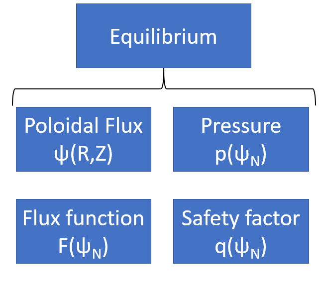

.. default-role:: math
.. _sec-equilibrium:

Equilibrium
===========

``Equilibrium`` defines a global 2D Tokamak equilibrium, and has the following data:

This can be used to load a ``LocalGeometry`` class at a given :math:`\psi_n`.

.. autoclass:: pyrokinetics.equilibrium.Equilibrium
  :members:
  :undoc-members:
  :show-inheritance:
