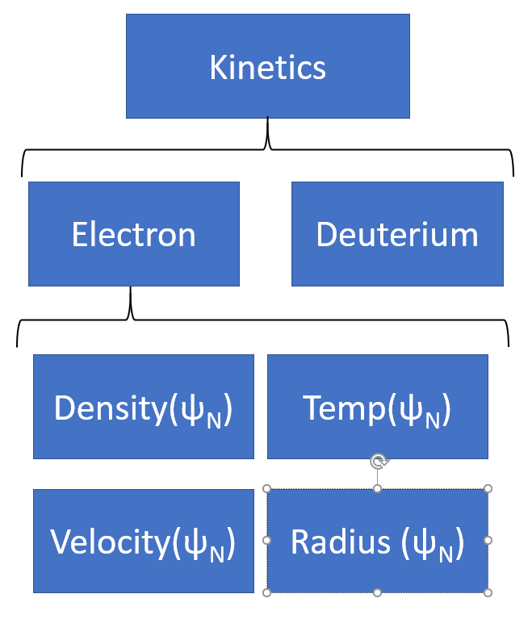

.. _sec-kinetics:

Kinetics
========

`Kinetics` class has the following data

Can be used to load :ref:`LocalSpecies<sec-local_species>` class

.. autoclass:: pyrokinetics.kinetics.Kinetics
  :members:
  :undoc-members:
  :show-inheritance:
