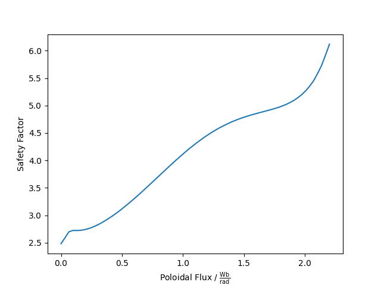
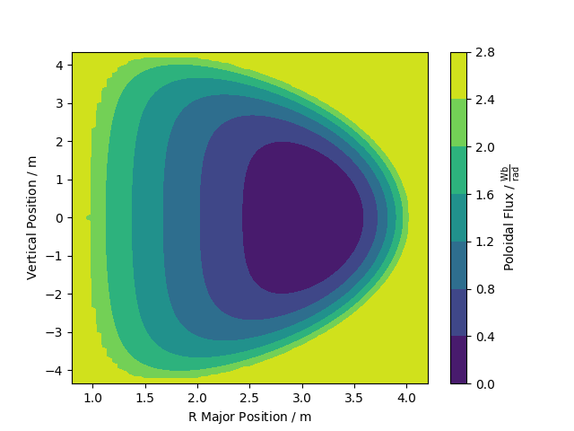
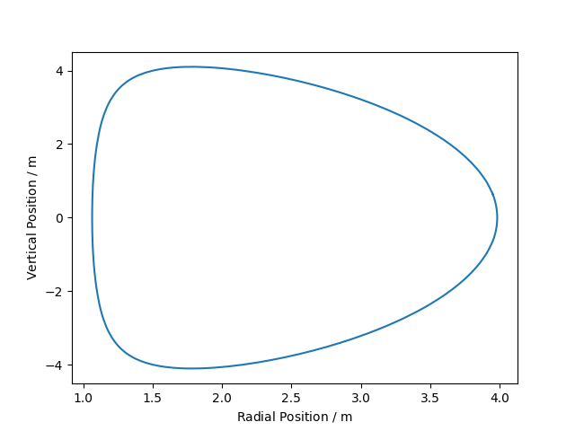
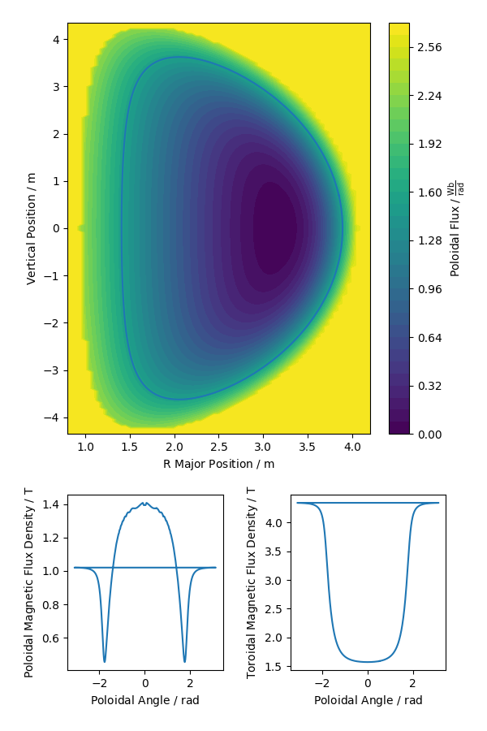

.. default-role:: math
.. _sec-equilibrium-tutorial:

Equilibrium Tutorial
====================

Pyrokinetics can be used to read and analyse tokamak plasma equilibrium files as
produced by software packages such as FreeGS_, EFIT_, TRANSP_ or VMEC_. These can be
used to generate information about individual flux surfaces, which in turn may be used
to set up a gyrokinetics simulation.

See :ref:`sec-background` for information about plasma
equilibria. :ref:`sec-reading-files` details how to read a file and use
``Equilibrium`` objects, while :ref:`sec-flux-surfaces` shows how to extract
individual flux surfaces and :ref:`sec-plotting` shows how to plot various
quantities. :ref:`sec-creating-local-geometries` provides information on how to create
``LocalGeometry`` objects and use our equilibrium-derived flux surfaces in a
gyrokinetics simulation.

.. _FreeGS: https://github.com/freegs-plasma/freegs
.. _EFIT: https://omfit.io/modules/mod_EFIT++.html
.. _TRANSP: https://transp.pppl.gov/
.. _VMEC: https://princetonuniversity.github.io/STELLOPT/VMEC

.. _sec-background:

Background
----------

The Grad-Shafranov equation [1]_ may be written:

.. math::
    \frac{\partial^2 \psi}{\partial r^2}
    - \frac{1}{r}\frac{\partial\psi}{\partial r}
    + \frac{\partial^2 \psi}{\partial z^2}
    = -\mu_0 r^2 p'(\psi) - f(\psi)f'(\psi)

The :math:`r` coordinate is the major radius, the distance from the central column
of a tokamak, and :math:`z` is the height within the tokamak (often defined as the
vertical distance about the tokamak midplane, but other reference points may be used
instead).

:math:`\psi` is the poloidal magnetic flux function, defined as:

.. math::
    \vec{B_p} = \frac{1}{r} \nabla\psi \times \hat{\phi}

where :math:`\vec{B_p}` is the poloidal magnetic field vector, and
:math:`\hat{\phi}` is the unit vector in the toroidal direction. :math:`\psi` is
arbitrary to within an additive constant. :math:`f` is the poloidal current
function, and is defined similarly:

.. math::
    \vec{J_p} = \frac{\mu_0}{r} \nabla f \times \hat{\phi}

where :math:`\vec{J_p}` is the poloidal current density. It may be shown that
:math:`f` is a function of :math:`\psi` only, as is the plasma pressure, :math:`p`.
Along with the safety factor, :math:`q(\psi)`:

.. math::
    q = \frac{1}{2\pi}\oint \frac{1}{r} \frac{B_\phi}{B_p} ds

which describes the number of times a magnetic field line wraps around the toroidal
direction before arriving at the same point in the poloidal plane, these quantities
describe a plasma equilibrium in full.

For gyrokinetics simulations, it is common for researchers to make use of the
normalised :math:`\psi_n`, which is scaled so that :math:`\psi_n=0` at the magnetic
axis, and :math:`\psi_n=1` at the Last Closed Flux Surface (LCFS).

.. [1] J. Wesson and D.J. Campbell: "Tokamaks", Oxford University Press, 2011,
    chapter 3

.. _sec-reading-files:

Reading Files
-------------

Equilibrium files may be read using the function ``read_equilibrium``. We will use the
example G-EQDSK file bundled with Pyrokinetics as an example.

.. code-block:: python

    >>> import pyrokinetics as pk
    >>> eq_filename = pk.eq_templates["GEQDSK"]
    >>> eq = pk.read_equilibrium(eq_filename)

We can see the contents of the ``Equilibrium`` object by ``print``-ing it:

.. code-block:: python

    >>> print(eq)
    <pyrokinetics.Equilibrium>
    (Wraps <xarray.Dataset>)
    Dimensions:   (R_dim: 69, Z_dim: 175, psi_dim: 69)
    Coordinates:
        R         (R_dim) float64 [m] 0.8 0.85 0.9 0.95 1.0 ... 4.05 4.1 4.15 4.2
        Z         (Z_dim) float64 [m] -4.35 -4.3 -4.25 -4.2 ... 4.2 4.25 4.3 4.35
        psi       (psi_dim) float64 [Wb/rad] 0.0 0.0324 0.0648 ... 2.138 2.171 2.203
    Dimensions without coordinates: R_dim, Z_dim, psi_dim
    Data variables:
        psi_RZ    (R_dim, Z_dim) float64 [Wb/rad] 2.644 2.644 2.644 ... 2.644 2.644
        f         (psi_dim) float64 [T·m] 5.145 5.21 5.272 5.329 ... 6.006 6.003 6.0
        ff_prime  (psi_dim) float64 [T²·m²·rad/Wb] 10.63 10.17 ... -0.5579 0.02098
        p         (psi_dim) float64 [Pa] 1.492e+06 1.458e+06 ... 2.117e+03 91.05
        p_prime   (psi_dim) float64 [Pa·rad/Wb] -1.065e+06 -1.05e+06 ... -2.539e+04
        q         (psi_dim) float64 [] 2.482 2.589 2.699 2.723 ... 5.731 5.92 6.118
        R_major   (psi_dim) float64 [m] 3.166 3.153 3.139 3.125 ... 2.514 2.507 2.5
        r_minor   (psi_dim) float64 [m] 0.0 0.1574 0.2249 0.2786 ... 1.476 1.488 1.5
        Z_mid     (psi_dim) float64 [m] 0.0 -0.0002509 ... -9.603e-07 1.49e-09
        rho       (psi_dim) float64 [] 0.0 0.105 0.15 0.1858 ... 0.9841 0.992 1.0
        psi_n     (psi_dim) float64 [] 0.0 0.01471 0.02941 ... 0.9706 0.9853 1.0
    Attributes: (12/17)
        R_axis:            3.16627797
        Z_axis:            0.0
        psi_axis:          0.0
        psi_lcfs:          2.2030412
        a_minor:           1.5000747773827081
        dR:                0.050000000000000044
        ...                ...
        software_version:  0.2.0a1.dev92+gfbbd8b3.d20221212
        object_type:       Equilibrium
        session_started:   2022-12-15 17:05:11.789094
        session_uuid:      9f836924-8ce1-4b67-afea-006f143c0ad1
        date_created:      2022-12-15 17:05:15.113352
        netcdf4_version:   1.5.8

We see that an ``Equilibrium`` wraps an Xarray Dataset (see the Xarray_ docs for more
information), and that it contains a wide range of data. Furthermore, as Pyrokinetics
makes use of Pint_ and pint-xarray_, each variable has an associated set of units.

Data is spread over two grids: the :math:`(R, Z)` grid, and the :math:`\psi` grid.
The only variable stored on the :math:`(R, Z)` grid is ``psi_RZ``, which is a 2D array
describing the poloidal magnetic flux function :math:`\psi` as a function of the
major-radial and vertical positions in a tokamak. All other variables are constants
over each flux surface, and hence they are expressed as functions of :math:`\psi`.
Global quantities are stored as attributes, including metadata about the Python session
in which the ``Equilibrium`` was created. Data may be accessed as follows:

.. code-block:: python

    >>> # Access a data_var
    >>> eq["psi_RZ"]
    <xarray.DataArray 'psi_RZ' (R_dim: 69, Z_dim: 175)>
    <Quantity([[2.64364955 2.64364955 2.64364955 ... 2.64364955 2.64364955 2.64364955]
     [2.64364955 2.64364955 2.64364955 ... 2.64364955 2.64364955 2.64364955]
     [2.64364955 2.64364955 2.64364955 ... 2.64364955 2.64364955 2.64364955]
     ...
     [2.64364955 2.64364955 2.64364955 ... 2.64364955 2.64364955 2.64364955]
     [2.64364955 2.64364955 2.64364955 ... 2.64364955 2.64364955 2.64364955]
     [2.64364955 2.64364955 2.64364955 ... 2.64364955 2.64364955 2.64364955]], 'weber / radian')>
    Coordinates:
        R        (R_dim) float64 [m] 0.8 0.85 0.9 0.95 1.0 ... 4.0 4.05 4.1 4.15 4.2
        Z        (Z_dim) float64 [m] -4.35 -4.3 -4.25 -4.2 ... 4.2 4.25 4.3 4.35
    Dimensions without coordinates: R_dim, Z_dim
    Attributes:
        long_name:  Poloidal Flux

    >>> # Access a coordinate
    >>> eq["psi"]
    <xarray.DataArray 'psi' (psi_dim: 69)>
    <Quantity([0.         0.03239766 0.06479533 0.09719299 0.12959066 0.16198832
     0.19438599 0.22678365 0.25918132 0.29157898 0.32397665 0.35637431
     0.38877198 0.42116964 0.45356731 0.48596497 0.51836264 0.5507603
     0.58315796 0.61555563 0.64795329 0.68035096 0.71274862 0.74514629
     0.77754395 0.80994162 0.84233928 0.87473695 0.90713461 0.93953228
     0.97192994 1.00432761 1.03672527 1.06912294 1.1015206  1.13391826
     1.16631593 1.19871359 1.23111126 1.26350892 1.29590659 1.32830425
     1.36070192 1.39309958 1.42549725 1.45789491 1.49029258 1.52269024
     1.55508791 1.58748557 1.61988324 1.6522809  1.68467856 1.71707623
     1.74947389 1.78187156 1.81426922 1.84666689 1.87906455 1.91146222
     1.94385988 1.97625755 2.00865521 2.04105288 2.07345054 2.10584821
     2.13824587 2.17064354 2.2030412 ], 'weber / radian')>
    Coordinates:
        psi      (psi_dim) float64 [Wb/rad] 0.0 0.0324 0.0648 ... 2.138 2.171 2.203
    Dimensions without coordinates: psi_dim
    Attributes:
        long_name:  Poloidal Flux

    >>> # Access an attribute
    >>> eq.psi_lcfs
    2.2030412 weber / radian

Note that Xarray ``DataArray`` and Pint ``Quantity`` objects may not behave well with
other libraries. If you run into problems, the following tips may be helpful:

.. code-block:: python

    >>> # Use .data to get the underlying Numpy array
    >>> eq["some_var"].data
    >>> # This will still be wrapped with Pint units!
    >>> # Strip them with:
    >>> eq["some_var"].data.magnitude
    >>> # Attributes may also carry units, which can be stripped with:
    >>> eq.some_attr.magnitude
    >>> # Although this may be expressed as a Numpy 0D array...
    >>> # To get this as a NumPy scalar, try:
    >>> eq.some_attr.magnitude[()]
    >>> # To get this as a built-in Python scalar, try:
    >>> eq.some_attr.magnitude.tolist()

``Equilibrium`` objects may be written to file as follows:

.. code-block:: python

    >>> eq.to_netcdf("my_netcdf.nc")

They can then be read using:

.. code-block:: python

    >>> eq = pk.read_equilibrium("my_netcdf.nc")

.. _Xarray: https://docs.xarray.dev/en/stable/index.html
.. _Pint: https://pint.readthedocs.io/en/stable/
.. _pint-xarray: https://pint-xarray.readthedocs.io/en/stable/

.. _sec-flux-surfaces:

Flux Surfaces
-------------

Individual flux surfaces can be extracted from an ``Equilibrium`` using the
``flux_surface`` function. This should be provided with a value for ``psi_n`` between
0 and 1, where ``psi_n=0`` represents the magnetic axis, and ``psi_n=1`` represents the
Last Closed Flux Surface (LCFS). These correspond to ``eq.psi_axis`` and ``eq.psi_lcfs``
respectively. We'll choose a surface close to the LCFS:

.. code-block:: python

    >>> fs = eq.flux_surface(0.95)

Similarly to ``Equilbrium``, the created ``FluxSurface`` objects wrap an Xarray dataset:

.. code-block:: python

    >>> print(fs)
    <pyrokinetics.FluxSurface>
    (Wraps <xarray.Dataset>)
    Dimensions:     (theta_dim: 447)
    Coordinates:
        theta       (theta_dim) float64 [rad] 0.4252 0.4277 0.458 ... 0.397 0.4252
    Dimensions without coordinates: theta_dim
    Data variables:
        R           (theta_dim) float64 [m] 3.95 3.95 3.944 ... 3.959 3.955 3.95
        Z           (theta_dim) float64 [m] 0.6458 0.65 0.7 0.75 ... 0.55 0.6 0.6458
        b_poloidal  (theta_dim) float64 [T] 1.656 1.656 1.659 ... 1.611 1.637 1.656
    Attributes: (12/22)
        R_major:            2.5237193707550047
        r_minor:            1.4594564009638589
        Z_mid:              -3.186962283840766e-06
        f:                  6.014908836271119
        p:                  17056.766187144673
        q:                  5.529838829776141
        ...                 ...
        software_version:   0.2.0a1.dev110+g0d1db10.d20230118
        object_type:        FluxSurface
        session_started:    2023-01-19 17:51:15.024390
        session_uuid:       3d0dc5e6-a07e-4aea-a88b-5ed1740d83d9
        date_created:       2023-01-19 17:52:04.012552
        netcdf4_version:    1.5.8

In this case, all variables are defined on a closed path, parameterised by the poloidal
angle :math:`\theta`. 

.. _sec-plotting:

Plotting
--------

Both ``Equilibrium`` and ``FluxSurface`` provide plotting utilities using Matplotlib_.

* ``Equilibrium`` can either plot a quantity on the :math:`\psi` grid using ``.plot`` or
  create a contour plot of :math:`\psi` over the :math:`(R, Z)` grid using ``.contour``.
* ``FluxSurface`` can plot a quantity on the :math:`\theta` grid using ``.plot``, or
  plot the closed path of the flux surface using ``.plot_path``.
* All plotting functions optionally take an ``Axes`` object on which to plot, but a new
  one is created if the user chooses not to provide one.
* All functions also return the ``Axes`` object they plotted on, so the user can
  manipulate their plots further if they wish.
* If the user wishes to view their plots immediately, they can pass ``show=True`` to
  each function.

To plot something on the ``Equilibrium`` :math:`\psi` grid, we should provide the name
of the quantity we wish to plot as the first argument. For example, we may plot the
safety factor with respect to :math:`\psi`:

.. code-block:: python

    >>> eq.plot("q", show=True)

This should generate a plot like the following:

We can plot :math:`\psi` over the :math:`(R, Z)` grid using:

.. code-block:: python

    >>> eq.contour(show=True)

Similarly, we can plot a quantity on a single flux surface using:

.. code-block:: python

    >>> eq.flux_surface(0.95).plot("b_poloidal", show=True)

.. image:: figures/flux_surface_b_poloidal_plot.png
   :width: 600

And we can plot the path of a single flux surface using:

.. code-block:: python

    >>> eq.flux_surface(0.95).plot_path(show=True)

By passing our own ``Axes`` objects, we can construct more complex plots:

.. code-block:: python

    import pyrokinetics as pk
    import matplotlib.pyplot as plt

    # Get equilibrium data and a specific flux surface
    eq_filename = pk.eq_templates["GEQDSK"]
    eq = pk.read_equilibrium(eq_filename)
    fs = eq.flux_surface(0.7)

    # Create subplots
    fig, axs = plt.subplots(ncols=1, nrows=3, figsize=(6, 9))
    # Combine the top two plots into a larger plot
    gs = axs[0].get_gridspec()
    axs[0].remove()
    axs[1].remove()
    big_ax = fig.add_subplot(gs[:2])

    # Plot contour plot on the top plot
    eq.contour(ax=big_ax, levels=40)

    # Add the flux surface path on top.
    # Set x_label and y_label to "" to avoid changing axes labels
    fs.plot_path(ax=big_ax, x_label="", y_label="")

    # Plot b_poloidal and b_toroidal over this path
    fs.plot("b_poloidal", ax=axs[2])

    # Save figure, show
    fig.tight_layout(pad=2.0)
    plt.savefig("my_plots.png")
    plt.show()

See the ``Equilibrium`` and ``FluxSurface`` API at :ref:`Equilibrium` for more
information on plotting functions.

.. _Matplotlib: https://matplotlib.org/

.. _sec-creating-local-geometries:

Creating Local Geometries
-------------------------

TODO
