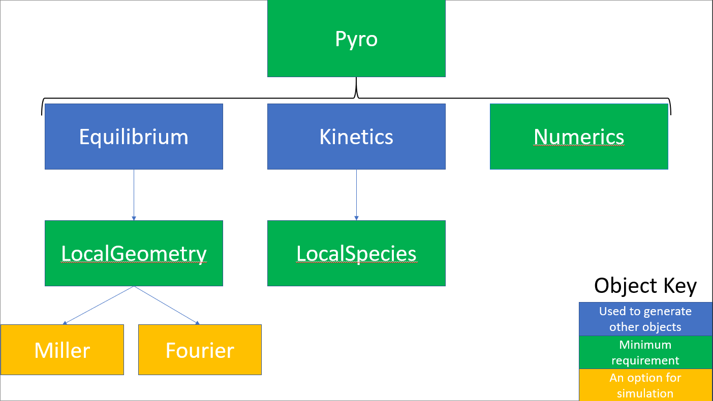

===========
 Structure
===========

The central interface of pyrokinetics is the `Pyro` class. Its main
components are as follows:

- `Equilibrium`

  - Accessed via ``pyro.eq``
  - Represents full 2D equilibrium
  - Only loaded when full equilibrium data is provided

- :py:class:`.LocalGeometry`

  - Accessed via ``pyro.local_geometry``
  - Represents local geometry of a flux surface
  - Current supported :class:`.LocalGeometry` subclasses are:

    - :class:`.LocalGeometryMiller` (see also :ref:`sec-miller`)
    - :class:`.LocalGeometryMillerTurnbull`
    - :class:`.LocalGeometryMXH`
    - :class:`.LocalGeometryFourierCGYRO`
    - :class:`.LocalGeometryFourierGENE`

- :py:class:`.Kinetics`

  - Accessed via ``pyro.kinetics``
  - Represents 1D profiles for each kinetic species
  - Only loaded when full profile data is provided

- `LocalSpecies`

  - Accessed via ``pyro.local_species``
  - Contains local species parameters

- `Numerics`

  - Accessed via ``pyro.numerics``
  - Sets up numerical grid and certain physics models

- :py:class:`.GKInput`

  - Accessed via ``pyro.gk_input``
  - Holds gyrokinetics input data and methods specific to each gyrokinetics code
  - Can be used to directly populate :py:class:`.LocalGeometry` and `LocalSpecies`
  - Used to set `Numerics`

* `normalisation`

  * Accessed via ``pyro.norms``
  * Holds physical reference values
  * Allows automatic conversion between different normalisation conventions

